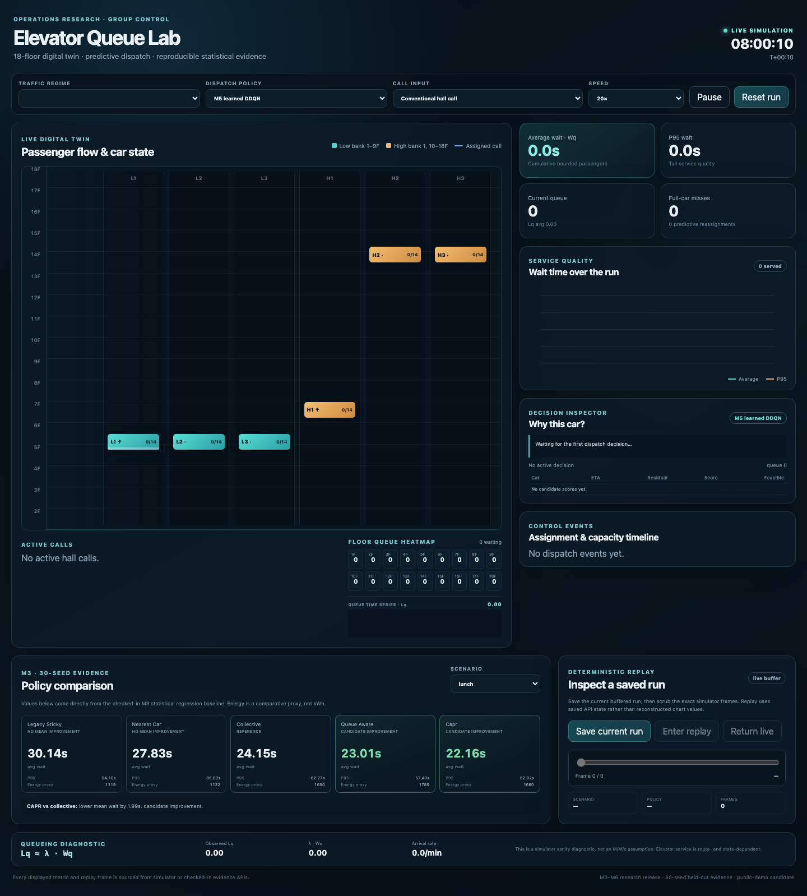
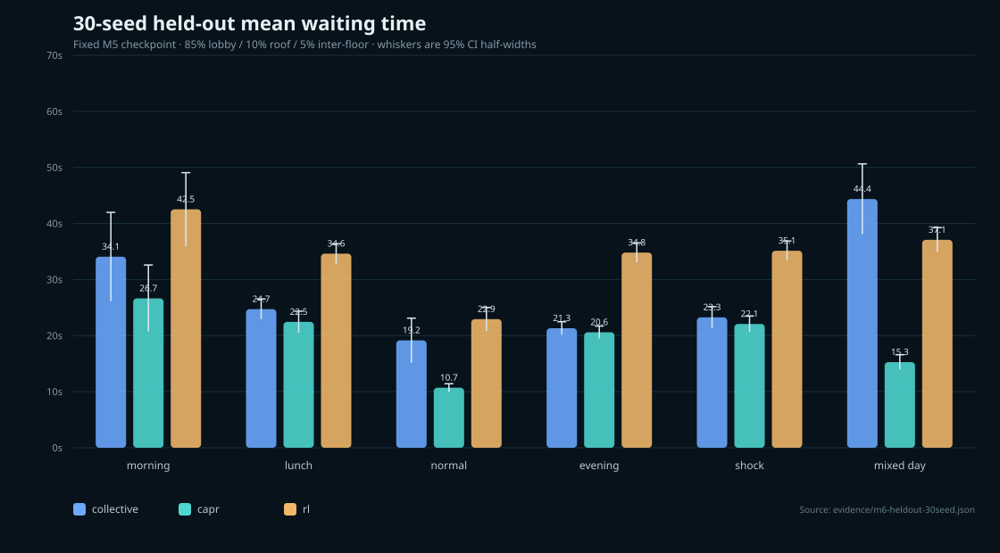
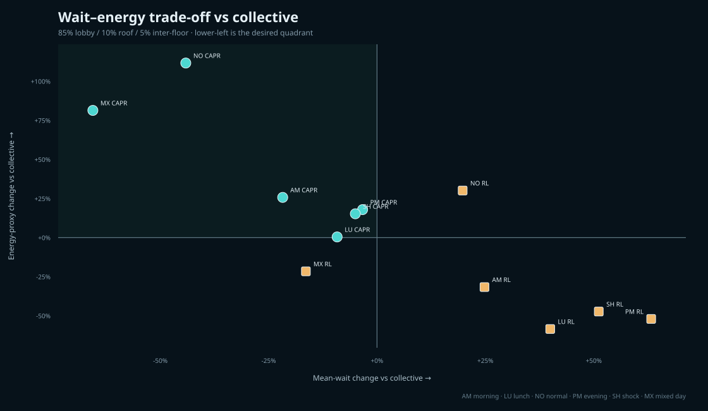

# Elevator Queue Lab

**A reproducible elevator group-control research lab for an 18-floor office building.**

**Live demo:** [https://elevator.oosu.dev/](https://elevator.oosu.dev/)

Elevator Queue Lab starts from a practical failure mode: a hall call is assigned to a car, that
car later becomes full or follows a poor route, and the passenger waits while the controller keeps
treating the stale assignment as valid. The project turns that observation into a controlled
simulation and optimization problem.

The target building has **18 floors and six passenger elevators**: three low-zone cars and three
high-zone cars. Synthetic office traffic changes through morning arrival, lunch inter-floor flow,
normal traffic and evening departure. Every passenger is represented from arrival at a hall call
through boarding and destination arrival, so dispatch decisions can be evaluated on passenger
outcomes instead of visual car movement alone.



The screenshot above is captured from the deployed public simulator at `elevator.oosu.dev` after
Chromium verifies the live UI/API contract: all six cars, all 18 floors, the evidence cards, the
learned-policy control path and simulator audit. It is not a mockup or static chart fixture.

## Research question

> Can continuous capacity-aware reassignment and demand-aware pre-positioning reduce both average
> and tail waiting time in a zoned six-car office elevator group without creating unacceptable
> energy use or floor-level unfairness?

The working controller family is **CAPR — Capacity-Aware Predictive Reassignment**. CAPR estimates
route-insertion pickup ETA and residual capacity, continuously re-evaluates an assignment,
invalidates a predicted-full car before the failed pickup, and uses hysteresis to prevent
reassignment oscillation. It remains a **hypothesis to test, not a claim of novelty or universal
superiority**.

## Current executable surface

- deterministic origin/destination passenger traces with canonical JSON + SHA-256 identity;
- sub-second six-car simulator with acceleration/deceleration, doors and passenger transfer time;
- low/high zoned banks and both conventional hall-call and destination-control grouping;
- sticky, nearest-car, collective, queue-aware and CAPR dispatch policies;
- route-insertion ETA, predicted pickup capacity, call-age scoring and demand-aware parking;
- assignment/reassignment decision ledger containing candidate scores and human-readable reasons;
- regression coverage for the motivating **17F full car / 16F waiting passenger** case;
- portfolio-grade 18-floor live digital twin with car phase/load/route, queue badges and assignment links;
- floor queue heatmap plus live/replay wait and queue time series sourced only from simulator state;
- dispatch event stream and candidate-level decision inspector for assignment/reassignment reasoning;
- deterministic saved-run replay with a timeline scrubber and live/replay state switching;
- 30-seed common-random-number experiment engine with morning/lunch/normal/evening/shock/mixed-day;
- P50/P95/P99 wait, journey time, throughput, unfinished queue, reassignment latency, floor fairness,
  capacity misses and a transparent comparative energy proxy;
- M3 policy-comparison cards exposed in the UI from the checked-in regression evidence baseline;
- Gymnasium-compatible M5 dispatch MDP with a 77-value observation, seven masked actions and an
  explicit wait/tail/fairness/capacity/energy reward contract;
- dependency-free Dueling Double DQN learned policy, checked-in model artifact and deterministic
  train/held-out evaluation command;
- `rl` runtime policy selectable in the live digital twin using the checked-in M5 model;
- JSON + run-level CSV + summary CSV evidence artifacts, paired effect sizes and guardrail flags;
- Playwright browser verification that visible metrics, all six cars and all 18 floor queues match API/replay state;
- responsive desktop/mobile visual QA with screenshots generated from that same verified browser run.

## First 30-seed evidence: CAPR is regime-dependent

The first M3 matrix runs **30 seeds × 6 scenarios × 5 policies = 900 controller simulations** with
the same passenger trace for every policy at a given seed. It deliberately does not produce a
single global winner.

- **Lunch:** CAPR is a clean candidate improvement: collective mean wait **24.15 s → 22.16 s** while
  the configured tail/fairness/energy guardrails remain within tolerance.
- **Normal:** CAPR improves mean wait **16.18 s → 12.04 s** and P95 **42.52 s → 26.81 s**, but the
  energy proxy rises **424 → 1122**, so the result is classified as a tradeoff rather than a win.
- **Mixed day:** CAPR strongly reduces wait (**50.26 s → 14.66 s**) but roughly doubles the energy
  proxy (**858 → 1734**), again triggering the energy guardrail.
- **Morning / evening / shock:** current CAPR does not beat collective on mean wait.
- **Morning:** the simpler nearest-car baseline is the strongest unconditional candidate in this
  short-window benchmark, useful evidence against forcing the project narrative toward CAPR.

See `docs/M3_FINDINGS.md` for the full interpretation and limitations. These are reproducible
simulation results, **not real-building performance claims**.

## First held-out learned-controller evidence: negative/mixed

M5 deliberately uses disjoint data: the model trains on passenger seeds **1–6** across five base
traffic regimes, while evaluation uses seeds **21–30**. `mixed_day` is excluded from training and
serves as the held-out traffic mixture. Collective, CAPR and RL see the same passenger trace for
each held-out scenario/seed.

- **Morning:** collective 14.60 s mean wait vs RL 27.87 s.
- **Lunch:** 24.37 s vs RL 29.88 s.
- **Normal:** 15.22 s vs RL 25.72 s.
- **Evening:** 18.35 s vs RL 30.67 s.
- **Shock:** 22.46 s vs RL 31.90 s.
- **Held-out mixed day:** collective 49.71 s vs RL 40.20 s; this is the only M5 scenario classified
  as a guardrail-clean candidate improvement.

So the checked-in Dueling Double DQN **does not pass the general-superiority gate**. Five traffic
regimes regress on mean wait; the one mixed-day improvement is not enough to declare a general RL
win. ETA/load/capacity/age/pre-positioning feature ablations do not overturn that conclusion.
See `docs/M5_MODEL_CARD.md` and `evidence/m5-heldout-evaluation.json`.

## Final 30-seed held-out release evidence

M6 keeps the exact M5 checkpoint fixed and expands the release evaluation to **30 disjoint
held-out passenger seeds (21–50)**. The overall conclusion is unchanged: CAPR is a clean candidate
only in lunch traffic, while normal/mixed traffic expose a strong service/energy trade-off; the RL
checkpoint improves only the unseen `mixed_day` mixture and is not a general replacement for the
heuristic controllers.





The strongest supported operating rule is therefore **regime-gated predictive intervention with
tail/fairness/energy vetoes**, not “always CAPR” and not “always RL.” See
`docs/M6_RESEARCH_REPORT.md` for the architecture, evidence interpretation, external references and
limitations, and `docs/M6_EVIDENCE_SUMMARY.md` for tables generated directly from committed JSON.

## Run locally

Python 3.11+ is enough for the simulator and research server.

```bash
python -m app.server --port 4173
```

Open `http://127.0.0.1:4173`. The UI can switch traffic regime, policy, simulation speed and
conventional versus destination-control call input, save the current run, scrub deterministic
replay frames and inspect the M3 comparison evidence.

Run validation and evidence generation:

```bash
python -m unittest discover -s tests -v
python scripts/generate_trace.py --scenario evening --seconds 600 --seed 7 --output /tmp/evening-trace.json
python scripts/run_experiment.py --scenario evening --seconds 600 --seeds 3
python scripts/run_experiment.py --scenario evening --seconds 600 --seeds 3 --control-mode destination
python scripts/run_experiment.py --matrix --seconds 180 --seeds 30 --output evidence/m3-evidence.json
python scripts/check_regression_baseline.py evidence/m3-evidence.json
python scripts/run_m5_training.py
python scripts/run_m6_evaluation.py
python scripts/generate_m6_assets.py
python scripts/audit_release.py
```

For browser/API visual verification:

```bash
npm install
npx playwright install chromium
python -m app.server --port 4173
npm run test:e2e
```

The matrix command emits a self-describing JSON artifact plus `*.runs.csv` and `*.summary.csv`.
Artifacts explicitly record a zero-second warm-up and the measurement window used by the run.

## Project status

**M0 reproducibility through M6 portfolio release are implemented.** The fixed M5 checkpoint has a
30-seed held-out release artifact, the final report/plots are generated from committed evidence,
and the public Mac mini deployment is live at `https://elevator.oosu.dev/`. External Chromium QA
verifies HTTP 200, six cars, all 18 floors, five evidence cards, the RL `mixed_day` control path,
simulator audit success, zero failed browser requests and zero console errors.
`docs/ROADMAP.md` is the canonical work queue and `AGENTS.md` defines the continuation contract for
future coding sessions.

## Methodology references

The modeling plan is informed by ISO 8100-32 traffic-planning concepts, CIBSE Guide D lift traffic
simulation/control topics, and current elevator group-control research. This project does **not**
claim formal standards compliance. See `docs/MODELING_PROTOCOL.md` for scope and limitations.

## License

MIT, unless a later dependency or imported dataset requires a narrower notice.
