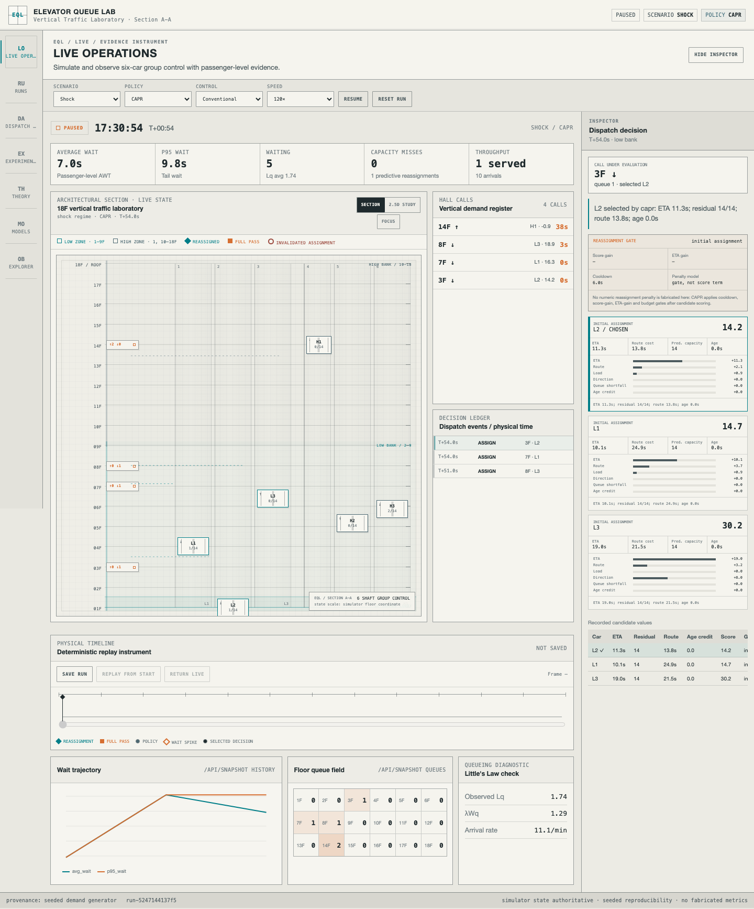
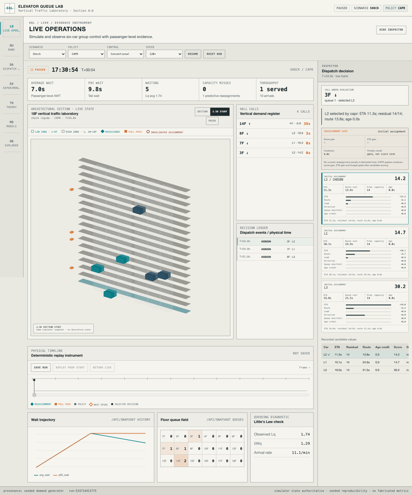
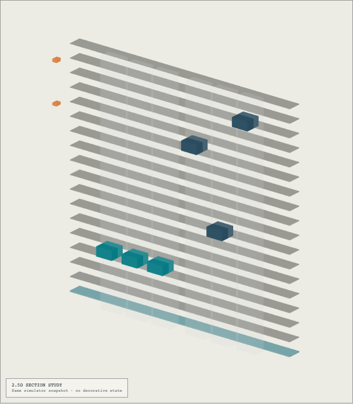
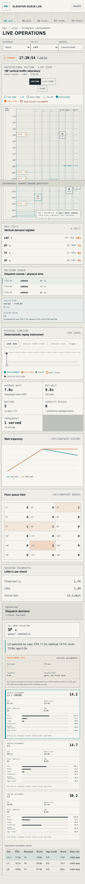
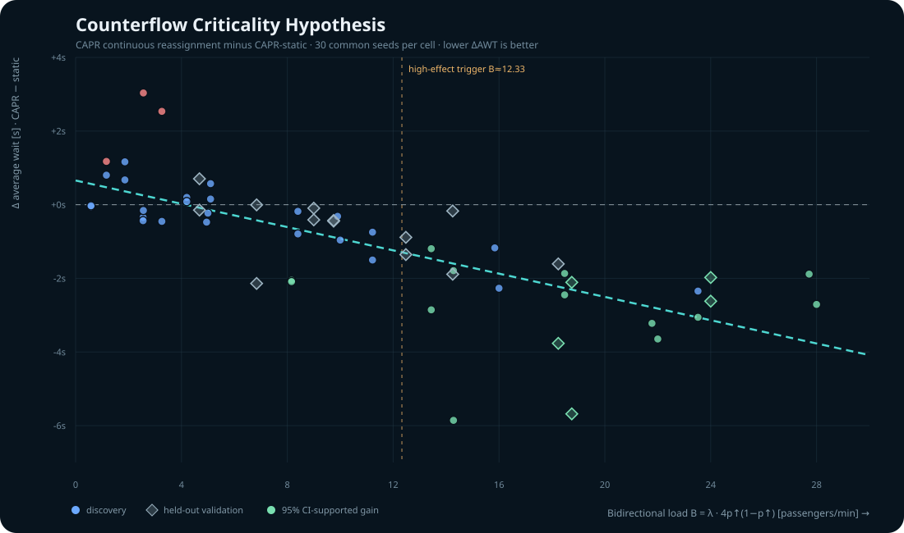

# Elevator Queue Lab

**A reproducible decision-intelligence workbench for elevator group-control research.**

**엘리베이터 군제어 연구를 위한 재현 가능한 Decision Intelligence Workbench입니다.**

**Live demo:** [https://elevator.oosu.dev/](https://elevator.oosu.dev/)

Elevator Queue Lab lets a reviewer **simulate, observe, inspect, explain, replay, compare and
falsify** dispatch decisions from passenger-level evidence. It starts from a practical failure
mode: a hall call is assigned to a car, that car later becomes full or follows a poor route, and
the passenger waits while the controller keeps treating the stale assignment as valid.

Elevator Queue Lab은 승객 단위 evidence를 기반으로 dispatch decision을 **simulate, observe, inspect, explain, replay, compare, falsify**할 수 있게 합니다. 핵심 문제는 assignment 시점에는 적절했던 car가 이후 full 상태나 route 변화로 나쁜 pickup 후보가 되었는데도 controller가 stale assignment를 계속 유지하는 상황입니다.

## 30-second orientation / 30초 요약

| Question | Answer |
| --- | --- |
| **What problem is being studied?** | Stale elevator assignments under stochastic load: a car that looked good at assignment time may become a poor or impossible pickup before it arrives. |
| **What is CAPR?** | Capacity-Aware Predictive Reassignment: route-insertion ETA + predicted residual capacity + route/load/age scoring + continuous reassignment with hysteresis. |
| **What did the experiments show?** | CAPR is **traffic-regime dependent**, not globally superior. Lunch is a clean M3 candidate improvement; several other regimes expose wait/energy trade-offs or no mean-wait win. |
| **What is Counterflow Criticality?** | M7 evidence supports a fuzzy congestion × counterflow transition: continuous reassignment becomes more valuable when traffic intensity and opposing directional flow rise together. The fitted threshold is **not** a universal critical constant. |
| **Did RL beat the heuristics?** | No general superiority was established. The fixed M5 Dueling Double DQN improves only the held-out mixed-day mixture cleanly; five base regimes regress versus collective. |
| **Can I reproduce it?** | Yes. The repository keeps deterministic traces, versioned provenance, committed statistical evidence, a production Python server path, unit/contract tests, Playwright E2E and visual regression. |

| 질문 | 답변 |
| --- | --- |
| **무슨 문제를 연구하나?** | Stochastic load에서 stale elevator assignment가 평균·tail wait, capacity miss, fairness에 어떤 영향을 주는지 연구합니다. |
| **CAPR은 무엇인가?** | Capacity-Aware Predictive Reassignment로, route-insertion ETA, predicted residual capacity, route/load/age score, continuous reassignment와 hysteresis를 결합합니다. |
| **실험 결과는?** | CAPR은 전역적으로 우월하지 않고 traffic regime에 따라 효과가 달랐습니다. Lunch는 clean candidate improvement이고 다른 regime은 wait/energy trade-off 또는 평균 wait 악화를 보입니다. |
| **Counterflow Criticality는?** | Traffic intensity와 opposing directional flow가 함께 높아질수록 continuous reassignment의 가치가 커진다는 fuzzy transition 가설입니다. Universal constant로 주장하지 않습니다. |
| **RL이 heuristic을 이겼나?** | 일반적 우월성은 확인되지 않았습니다. Held-out mixed-day에서만 clean improvement가 나타났고 다섯 base regime에서는 collective 대비 악화했습니다. |
| **재현 가능한가?** | 가능합니다. Deterministic trace, versioned provenance, committed statistical evidence, production server path, browser verification asset을 저장합니다. |

The product flow is:

```text
SIMULATE → OBSERVE → INSPECT → EXPLAIN → REPLAY → COMPARE → FALSIFY
```

The target building has **18 floors and six passenger elevators**: three low-zone cars and three
high-zone cars. The default synthetic workplace mix is deliberately lobby-centric: **85% of trips
touch 1F, 10% use 18F as a roof-access proxy and only 5% are same-bank inter-floor trips**. Time of
day changes the direction of that mix rather than inventing dense floor-to-floor traffic. Every
passenger is represented from arrival at a hall call
through boarding and destination arrival, so dispatch decisions can be evaluated on passenger
outcomes instead of visual car movement alone.

대상 건물은 **18층, 6대의 승객용 엘리베이터**이며 low-zone 3대와 high-zone 3대로 구성합니다. 기본 synthetic workplace demand는 1F 중심 85%, 18F roof-access proxy 10%, same-bank inter-floor 5%로 두고, 시간대에 따라 trip-purpose mix 자체보다 방향성을 변화시킵니다. 모든 승객의 arrival → assignment → boarding → destination arrival을 추적해 단순 car animation이 아니라 passenger outcome으로 정책을 평가합니다.



The current authored UI uses an **Architectural Section × Kinetic Transit Laboratory** direction:
warm-white/concrete surfaces, graphite structure lines, restrained cyan/safety-orange state marks,
an 18-floor sectional building instrument and a physical replay timeline. The desktop workbench rail
uses a fixed wide layout so every navigation label remains fully readable. The screenshot is captured
by Chromium from the real local Python server after a CAPR shock run; it is not a mockup or static
chart fixture. The public demo uses the same single-process Python/static-serving contract at
`https://elevator.oosu.dev/`.

| 2.5D comparison study / 2.5D 비교 연구 | Purpose-built 390px mobile / 390px 모바일 |
| --- | --- |
| <br/><br/> |  |

The 2.5D React Three Fiber view is an optional desktop study using the same simulator `Snapshot`.
It is lazy-loaded and disabled on compact, low-power or WebGL-unavailable clients. The accessible,
testable 2D section remains authoritative because it exposes floor, car, queue and assignment state
more clearly. See `docs/reference-adoption.md` for the measured comparison and license audit.

2.5D React Three Fiber view는 같은 simulator `Snapshot`을 읽는 optional desktop study입니다. Compact viewport, low-power, WebGL unavailable 환경에서는 비활성화되며, floor/car/queue/assignment state를 더 명확하게 노출하는 2D section이 authoritative view로 유지됩니다.

> **Research takeaway — congestion alone is not the trigger.** Continuous predictive reassignment
> becomes valuable when **heavy traffic and enough counterflow rise together**, because opposing
> directional demand makes stale assignments increasingly costly to keep. In practical terms:
> **do not reassign just because the system is busy; reassign when directional competition is high
> enough to justify the churn.** The M7 controlled sweep and held-out falsification below quantify
> this as the Counterflow Criticality Hypothesis.

## Research question / 연구 질문

> Can continuous capacity-aware reassignment and demand-aware pre-positioning reduce both average
> and tail waiting time in a zoned six-car office elevator group without creating unacceptable
> energy use or floor-level unfairness?

The working controller family is **CAPR — Capacity-Aware Predictive Reassignment**. CAPR estimates
route-insertion pickup ETA and residual capacity, continuously re-evaluates an assignment,
invalidates a predicted-full car before the failed pickup, and uses hysteresis to prevent
reassignment oscillation. It remains a **hypothesis to test, not a claim of novelty or universal
superiority**.

연구 질문은 **continuous capacity-aware reassignment와 demand-aware pre-positioning이 zoned six-car office elevator group에서 평균 및 tail waiting time을 줄이면서도 energy/fairness guardrail을 지킬 수 있는가?**입니다. CAPR은 검증해야 할 hypothesis이며 novelty나 universal superiority를 주장하지 않습니다.

## Current executable surface / 현재 실행 가능한 기능

현재 surface는 React + TypeScript workbench, deterministic passenger trace, six-car sub-second simulator, multiple dispatch policies, decision ledger, replay, Decision Trace graph, M3/M5/M7 evidence workbench, learned-policy artifact, typed `ChartSpec`, JSON/CSV evidence export를 하나의 product shell에서 연결합니다.

- React + TypeScript authored frontend in `frontend/`, with Vite producing the committed `web/`
  production artifact so `python -m app.server --port 4173` remains the one-command runtime;
- Decision Intelligence Product Shell with Live Operations, Runs, Dispatch Analysis, Experiments,
  Counterflow Criticality, Models and Object Explorer workbenches, plus a full-label desktop rail;
- deterministic origin/destination passenger traces with canonical JSON + SHA-256 identity;
- versioned trace/run/dispatch/evidence artifact catalog with seed/scenario/policy/config provenance;
- sub-second six-car simulator with acceleration/deceleration, doors and passenger transfer time;
- low/high zoned banks and both conventional hall-call and destination-control grouping;
- sticky, nearest-car, collective, queue-aware and CAPR dispatch policies;
- route-insertion ETA, predicted pickup capacity, call-age scoring and demand-aware parking;
- assignment/reassignment decision ledger containing candidate scores and human-readable reasons;
- regression coverage for the motivating **17F full car / 16F waiting passenger** case;
- portfolio-grade architectural-section 18-floor live digital twin with low/high zones, car
  phase/load/door/direction state, queue badges, assignment/reassignment, stale-assignment and
  full-pass notation plus a desktop-only 2.5D comparison study sourced from the same snapshot;
- floor queue heatmap plus live/replay wait and queue time series sourced only from simulator state;
- dispatch event stream and candidate-level decision inspector with exact ETA, route, residual
  capacity, age and recorded score-term decomposition plus explicit CAPR reassignment gates;
- deterministic saved-run replay with a physical event timeline for reassignments, full passes,
  policy state, wait spikes and the selected decision; building, charts and inspector move to the
  same replay frame;
- browseable Elevator/Passenger/HallCall/DispatchDecision/Run/Experiment/Model/Evidence objects;
- read-only xyflow Decision Trace graph projected from simulator state, decision history and the
  event ledger, with deterministic evidence stages, pan/zoom/focus, inspector linkage and an open
  accessible relationship-list alternative;
- deterministic **Ask This Run** explanations backed by recorded evidence and committed M3
  comparisons; no LLM is required or treated as a source of truth;
- typed semantic `ChartSpec` validation and registered React renderers instead of arbitrary
  generated HTML/JavaScript;
- 30-seed common-random-number experiment engine with morning/lunch/normal/evening/shock/mixed-day;
- P50/P95/P99 wait, journey time, throughput, unfinished queue, reassignment latency, floor fairness,
  capacity misses and a transparent comparative energy proxy;
- M3 decision dashboard backed by the checked-in regression evidence baseline: guardrail-aware
  policy ranking, raw speed rank, 95% CI/tail/fairness/energy table and a KDE over the 30 actual
  per-seed average-wait observations for each dispatch policy;
- M7 counterflow-criticality panel backed by a CAPR-vs-CAPR-static ablation, controlled λ/p phase
  sweep and an unseen-grid falsification run rather than hand-entered theory claims;
- Gymnasium-compatible M5 dispatch MDP with a 77-value observation, seven masked actions and an
  explicit wait/tail/fairness/capacity/energy reward contract;
- dependency-free Dueling Double DQN learned policy, checked-in model artifact and deterministic
  train/held-out evaluation command;
- `rl` runtime policy selectable in the live digital twin using the checked-in M5 model;
- JSON + run-level CSV + summary CSV evidence artifacts, paired effect sizes and guardrail flags;
- Playwright browser verification that visible metrics, all six cars and all 18 floor queues match API/replay state;
- deterministic visual regression for Live Operations desktop/mobile, Replay, Experiments, Theory,
  Models and Explorer/Decision Trace;
- `npm run capture:showcase` portfolio capture from the real backend and production frontend.

## 30-seed evidence: CAPR is regime-dependent / 30-se드 근거: CAPR은 traffic regime에 의존

The first M3 matrix runs **30 seeds × 6 scenarios × 5 policies = 900 controller simulations** with
the same passenger trace for every policy at a given seed. It deliberately does not produce a
single global winner.

- **Lunch:** CAPR is a clean candidate improvement: collective mean wait **24.84 s → 21.77 s** while
  the configured tail/fairness/energy guardrails remain within tolerance.
- **Morning:** CAPR improves collective **35.70 s → 24.45 s**, but energy rises **801 → 1005**;
  simpler sticky/nearest baselines are faster still, so CAPR is not the right default here.
- **Normal:** CAPR improves mean wait **18.12 s → 11.48 s** and P95 **49.59 s → 25.38 s**, but the
  energy proxy rises **524 → 1113**, so the result remains a tradeoff.
- **Mixed day:** CAPR strongly reduces wait (**39.32 s → 15.20 s**) but energy rises **893 → 1711**.
- **Evening / shock:** current CAPR does not beat collective on mean wait in the M3 baseline.

See `docs/M3_FINDINGS.md` for the full interpretation and limitations. These are reproducible
simulation results, **not real-building performance claims**.

M3의 30 seed × 6 scenario × 5 policy 비교는 CAPR이 단일 global winner가 아니라는 점을 보여줍니다. Lunch는 clean candidate improvement이지만 Morning/Normal/Mixed-day는 energy trade-off가 있고 Evening/Shock에서는 collective 평균 wait을 이기지 못했습니다. 이는 재현 가능한 simulation result이며 실제 건물 성능 주장이 아닙니다.

## M7 theory candidate: counterflow criticality / M7 이론 후보: Counterflow Criticality

**Key takeaway:** “reassign under congestion” is too crude. The evidence instead supports a
**congestion × counterflow** rule: stale-assignment correction becomes materially more valuable only
when traffic intensity and opposing directional flow are both high enough. That distinction explains
why the project sees a low-churn morning regime (`B = 2.56`) but a predictive-reassignment lunch
regime (`B = 15.84`) even though both can be busy office periods.

The scenario-level result suggested a deeper question: why is predictive reassignment useful in
lunch-like traffic but wasteful in strongly one-way peaks? M7 isolates that mechanism with
`capr_static`, which uses the same CAPR scoring and parking logic while disabling only continuous
reconsideration of already-owned calls.

Across **40 controlled traffic cells × 30 seeds × 3 policies = 3,600 discovery runs**, a normalized
bidirectional-load index

`B = λ × 4p↑(1 − p↑)`

tracks the marginal CAPR reassignment effect: discovery correlation with CAPR-minus-static average
wait is **r = −0.748**. Low-B cells show reassignment churn; high-B cells increasingly benefit from
predictive ownership changes. A strict 95%-CI gain trigger near **B ≈ 12.33** classifies 87.5% of
the discovery grid.

The trigger was frozen and tested on **18 unseen λ/p cells × 30 seeds = 1,080 additional
paired-policy runs**. Accuracy drops to **72.2%**, so the repository explicitly rejects a hard
universal critical-constant claim. It still captures every held-out CI-supported gain, and the
continuous discovery equation generalizes with held-out effect correlation **r = 0.672** and
**0.805 s MAE**.

Applying the frozen B trigger as an offline selector on those held-out cells keeps **88.1% of the
always-on CAPR wait gain while reducing CAPR's additional energy overhead by 58.3%**. This makes the
candidate theory operational: richer reassignment may be best treated as a gated intervention,
not a permanently active feature.

The current result is therefore a **Counterflow Criticality Hypothesis**: continuous predictive
reassignment appears to undergo a fuzzy transition from churn to useful intervention as directional
competition and traffic intensity increase together. It is a project-specific empirical theory to
falsify on other building sizes, capacities and trip-purpose mixes—not a claimed universal theorem
or established algorithmic novelty. See
[`docs/M7_COUNTERFLOW_CRITICALITY.md`](docs/M7_COUNTERFLOW_CRITICALITY.md).

M7은 `capr_static` ablation으로 continuous reassignment만 분리하고 λ × directional-mixing surface를 스윕했습니다. 결과는 단순 “혼잡하면 reassign”보다 **traffic intensity × counterflow가 함께 높아질 때 stale assignment correction의 가치가 커진다**는 쪽을 지지합니다. Discovery threshold는 held-out grid에서 정확도가 낮아져 universal critical constant로는 기각했고, fuzzy operational hypothesis로 보존했습니다.



## First held-out learned-controller evidence: negative/mixed / 첫 held-out learned-controller 근거: 부정적·혼합 결과

M5 deliberately uses disjoint data: the model trains on passenger seeds **1–6** across five base
traffic regimes, while evaluation uses seeds **21–30**. `mixed_day` is excluded from training and
serves as the held-out traffic mixture. Collective, CAPR and RL see the same passenger trace for
each held-out scenario/seed.

- **Morning:** collective 34.16 s mean wait vs RL 42.24 s.
- **Lunch:** 22.47 s vs RL 34.79 s.
- **Normal:** 17.50 s vs RL 22.83 s.
- **Evening:** 20.69 s vs RL 34.76 s.
- **Shock:** 21.84 s vs RL 35.08 s.
- **Held-out mixed day:** collective 37.72 s vs RL 35.72 s; this is the only M5 scenario classified
  as a guardrail-clean candidate improvement.

So the checked-in Dueling Double DQN **does not pass the general-superiority gate**. Five traffic
regimes regress on mean wait; the one mixed-day improvement is not enough to declare a general RL
win. ETA/load/capacity/age/pre-positioning feature ablations do not overturn that conclusion.
See `docs/M5_MODEL_CARD.md` and `evidence/m5-heldout-evaluation.json`.

M5 Dueling Double DQN은 일반적 우월성 gate를 통과하지 못했습니다. Held-out `mixed_day`에서는 clean candidate improvement가 있었지만 Morning/Lunch/Normal/Evening/Shock에서는 collective 대비 평균 wait이 악화했습니다. 이 negative/mixed result를 그대로 보존합니다.

## Final 30-seed held-out release evidence / 최종 30-se드 held-out release 근거

M6 keeps the exact retrained M5 checkpoint fixed and expands the release evaluation to **30 disjoint
held-out passenger seeds (21–50)**. The overall conclusion is unchanged: CAPR is a clean candidate
only in lunch traffic, while morning/normal/evening/shock/mixed traffic all expose either no gain or
a service/energy trade-off; the RL
checkpoint improves only the unseen `mixed_day` mixture and is not a general replacement for the
heuristic controllers.


The strongest supported operating rule is therefore **regime-gated predictive intervention with
tail/fairness/energy vetoes**, not “always CAPR” and not “always RL.” See
`docs/M6_RESEARCH_REPORT.md` for the architecture, evidence interpretation, external references and
limitations, and `docs/M6_EVIDENCE_SUMMARY.md` for tables generated directly from committed JSON.

M6는 동일 fixed checkpoint를 유지한 채 passenger seed 21–50으로 held-out evaluation을 확장했고 결론은 유지되었습니다. 가장 강하게 지지되는 운영 규칙은 “always CAPR”이나 “always RL”이 아니라 **regime-gated predictive intervention + tail/fairness/energy veto**입니다.

## Run locally / 로컬 실행

Python 3.11+ is enough to run the committed production workbench. Node is only required when
changing or rebuilding the React frontend.

Committed production workbench 실행에는 Python 3.11+이면 충분하고, React frontend를 수정하거나 다시 빌드할 때만 Node가 필요합니다.

```bash
python -m app.server --port 4173
```

Open `http://127.0.0.1:4173`. The UI can switch traffic regime, policy, simulation speed and
conventional versus destination-control call input, save and scrub replay, inspect dispatch
decisions, browse run objects and Decision Trace, query deterministic explanations and inspect
committed M3/M5/M7 evidence.

Frontend contributor gates:

```bash
npm ci --prefix frontend
npm run typecheck --prefix frontend
npm test --prefix frontend
npm run build --prefix frontend
```

Run validation and evidence generation:

```bash
python -m unittest discover -s tests -v
python scripts/generate_trace.py --scenario evening --seconds 600 --seed 7 --output /tmp/evening-trace.json
python scripts/generate_trace.py --scenario evening --seconds 600 --seed 7 --output /tmp/evening-trace.json --package-dir /tmp/evening-trace-package
python scripts/run_experiment.py --scenario evening --seconds 600 --seeds 3
python scripts/run_experiment.py --scenario evening --seconds 600 --seeds 3 --control-mode destination
python scripts/run_experiment.py --matrix --seconds 180 --seeds 30 --output evidence/m3-evidence.json
python scripts/check_regression_baseline.py evidence/m3-evidence.json
python scripts/run_m5_training.py
python scripts/run_m6_evaluation.py
python scripts/generate_m6_assets.py
python scripts/audit_release.py
```

For browser/API visual verification:

```bash
npm ci
npm ci --prefix frontend
npm run frontend:build
npx playwright install chromium
npm run test:e2e
npm run capture:showcase
```

Playwright starts the production Python server automatically unless `BASE_URL` points at an
already-running instance. Intentional visual-baseline updates use `npm run test:e2e:update`.

The matrix command emits a self-describing JSON artifact plus `*.runs.csv` and `*.summary.csv`.
Artifacts explicitly record a zero-second warm-up and the measurement window used by the run.

## Project status / 프로젝트 상태

**M0 through M8 are implemented in the repository.** The research simulator, 30-seed evidence,
negative/mixed learned-controller result and M7 falsification evidence are preserved; M8 adds the
typed decision-intelligence product layer without rewriting the simulator core. See
`docs/M8_PRODUCT_WORKBENCH.md` for the architecture and migration contract.

The existing public Mac mini demo remains at `https://elevator.oosu.dev/`. A local or PR M8 result
is not treated as proof that the public instance has been upgraded: deployment and remote
Chromium/API QA must be run against the exact M8 commit before that claim is made.
`docs/ROADMAP.md` remains the canonical milestone record and `AGENTS.md` defines the continuation
contract.

현재 M0–M8이 저장소에 구현되어 있으며 simulator core, 30-seed evidence, negative/mixed RL result, M7 falsification evidence를 유지한 채 M8 Decision Intelligence Product Workbench를 추가했습니다. `docs/ROADMAP.md`가 milestone 기준 문서이고 `AGENTS.md`가 후속 작업 contract입니다.

## Methodology references / 방법론 참고자료

The modeling plan is informed by ISO 8100-32 traffic-planning concepts, CIBSE Guide D lift traffic
simulation/control topics, and current elevator group-control research. This project does **not**
claim formal standards compliance. See `docs/MODELING_PROTOCOL.md` for scope and limitations.

ISO 8100-32 traffic-planning concept, CIBSE Guide D lift traffic simulation/control topic, elevator group-control research를 참고하지만 formal standards compliance를 주장하지 않습니다. 범위와 한계는 `docs/MODELING_PROTOCOL.md`에 기록합니다.

## License / 라이선스

MIT, unless a later dependency or imported dataset requires a narrower notice.

## Architecture & Topics / 아키텍처 및 주제

**Architecture / 아키텍처**<br>
[`discrete-event-simulation`](https://github.com/topics/discrete-event-simulation) · [`digital-twin`](https://github.com/topics/digital-twin) · [`queueing-model`](https://github.com/topics/queueing-model) · [`policy-based-design`](https://github.com/topics/policy-based-design) · [`strategy-pattern`](https://github.com/topics/strategy-pattern) · [`simulation-driven-design`](https://github.com/topics/simulation-driven-design) · [`event-scheduling`](https://github.com/topics/event-scheduling) · [`closed-loop-control`](https://github.com/topics/closed-loop-control)

**Project context / 프로젝트 맥락**<br>
[`control-systems`](https://github.com/topics/control-systems) · [`dispatch-algorithm`](https://github.com/topics/dispatch-algorithm) · [`elevator`](https://github.com/topics/elevator) · [`elevator-control`](https://github.com/topics/elevator-control) · [`gymnasium`](https://github.com/topics/gymnasium) · [`machine-learning`](https://github.com/topics/machine-learning) · [`operations-research`](https://github.com/topics/operations-research) · [`optimization`](https://github.com/topics/optimization) · [`queueing-theory`](https://github.com/topics/queueing-theory) · [`reinforcement-learning`](https://github.com/topics/reinforcement-learning) · [`research-tool`](https://github.com/topics/research-tool) · [`simulation`](https://github.com/topics/simulation) · [`traffic-simulation`](https://github.com/topics/traffic-simulation)

**Implementation stack / 구현 스택**<br>
[`python`](https://github.com/topics/python) · [`react`](https://github.com/topics/react) · [`typescript`](https://github.com/topics/typescript) · [`playwright`](https://github.com/topics/playwright)
