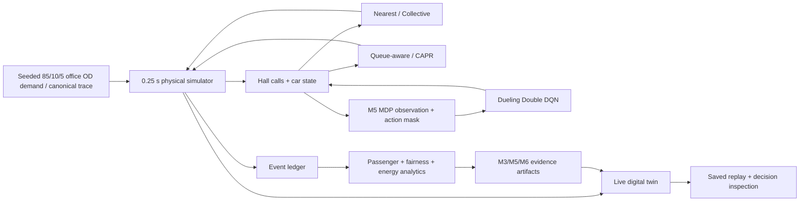

# M6 research report — what the experiments actually support

## Executive conclusion

Elevator Queue Lab does **not** support a single universally superior controller.

Across the committed M3 30-seed matrix and the M6 30-seed held-out release evaluation, the most
defensible result is a **regime-gated, guardrail-constrained use of predictive reassignment**:

1. keep a simple collective/nearest baseline as the default;
2. enable capacity-aware predictive reassignment when route competition and mixed/inter-floor
   demand make stale ownership costly;
3. reject a mean-wait gain when it buys that gain with an unacceptable tail, floor-fairness or
   energy-proxy regression;
4. do not promote the current learned controller to a global replacement for the heuristic stack.

The evidence is strongest for **lunch traffic**, where CAPR is the only guardrail-clean improvement
in both the 30-seed M3 matrix and the independent 30-seed M6 held-out evaluation. Under `morning`,
`normal`, `evening`, `shock` and `mixed_day`, CAPR either fails to improve mean wait or buys a wait
reduction with enough extra movement to trip the energy guardrail. The richer controller therefore
has useful intervention value, but not a case for unconditional use.

The fixed M5 Dueling Double DQN checkpoint also fails its global gate. It is worse than collective
on mean waiting time in five of six held-out regimes and improves only the completely unseen
`mixed_day` mixture. That isolated result is useful evidence for future bounded adaptation, not a
reason to replace the deterministic controller.


The exact generated tables are in `docs/M6_EVIDENCE_SUMMARY.md`; machine-readable evidence is in
`evidence/m3-regression-baseline.json`, `evidence/m5-heldout-evaluation.json` and
`evidence/m6-heldout-30seed.json`.

## Research system

The project studies an 18-floor office with three low-zone cars (1F, 2F–9F) and three high-zone
cars (1F, 10F–18F). The synthetic workplace prior is **85% lobby-linked / 10% 18F roof-access /
5% same-bank inter-floor**; time-of-day regimes mainly change the direction of the lobby-linked
majority. Every passenger has an origin, destination and lifecycle timestamps. The
simulator uses a 0.25 s physical step with acceleration/deceleration, explicit door phases,
passenger transfer dwell and hard capacity constraints.

The architecture keeps stochastic demand, physical state transitions, controller decisions and
statistical analysis separate:



This separation matters because a controller is never evaluated against fabricated UI data or a
separate simplified transition model. M5 actions are passed back through the simulator's ordinary
assignment/reassignment, route ownership and event-ledger invariants.

## Experimental contracts

### M3 controller matrix

- 30 common-random-number seeds per scenario;
- six scenarios: morning, lunch, normal, evening, shock, mixed day;
- five deterministic controllers;
- 180 s measurement window with explicitly recorded zero-second warm-up;
- 900 controller runs total;
- explicit demand contract embedded in the evidence artifact: 85% lobby-linked, 10% roof-access,
  5% same-bank inter-floor;
- mean/P50/P95/P99 wait, journey time, throughput, unfinished queue, capacity misses,
  reassignment latency, floor fairness and a transparent movement/start/service energy proxy;
- paired effect sizes and 95% confidence intervals;
- a guardrail rejects an apparent mean-wait win when P95, worst-floor or energy deterioration is
  too large.

### M5 training and first held-out evaluation

- train traffic: morning, lunch, normal, evening, shock;
- training passenger seeds: 1–6;
- fixed algorithm seed: 2026;
- fixed final checkpoint after a predeclared 60-episode budget;
- first held-out passenger seeds: 21–30;
- `mixed_day` absent from training;
- feature ablations: ETA, load, capacity, call age, pre-positioning context.

### M6 release evaluation

M6 does **not** retrain or reselect the M5 checkpoint. It runs the same model artifact over 30
held-out passenger seeds, **21–50**, on all six scenarios. These seeds remain disjoint from training
seeds 1–6. For every scenario/seed, collective, CAPR and RL receive the same passenger trace.

This release contract is generated by:

```bash
python scripts/run_m6_evaluation.py
python scripts/generate_m6_assets.py
```

The fixed model SHA-256 recorded in the M6 artifact is
`357709ca7a4b2f57cf8d4c67acabeca774fb507baf59fd4f77ac3ce370a138e6`.

## Finding 1 — lunch is the clearest CAPR regime

In M3, collective mean waiting time is **24.84 s** and CAPR is **21.77 s** with a clean guardrail
classification. In the separate 30-seed M6 held-out run, collective is **24.73 s** and CAPR is
**22.45 s**. The paired held-out mean delta is about **-2.28 s**, with a 95% CI half-width of about
**2.66 s**.

This is the only traffic regime in which the project's current evidence repeatedly gives the full
predictive controller a clean guardrail classification. The held-out CI is wider than the mean
delta, so the result is a practical candidate rather than strong statistical proof of superiority.

Interpretation: even with inter-floor traffic capped at 5%, the bidirectional lunch lobby wave still
creates enough competing routes for route-insertion ETA and predicted pickup capacity to correct
stale assignments, while the additional movement remains within the current energy tolerance.

## Finding 2 — normal and mixed traffic expose a service/energy frontier

The largest CAPR wait reductions do not automatically count as wins.

- M3 morning: **35.70 s → 24.45 s**, but energy proxy **801 → 1005** and simpler sticky/nearest
  baselines are faster still.
- M3 normal: **18.12 s → 11.48 s**, but energy proxy **524 → 1113**.
- M3 mixed day: **39.32 s → 15.20 s**, but energy proxy **893 → 1711**.
- M6 held-out normal: **19.15 s → 10.70 s**, again with a large energy increase.
- M6 held-out mixed day: **44.36 s → 15.28 s**, again with a large energy increase.
- M6 held-out morning: **34.07 s → 26.66 s**, but energy proxy **827 → 1040**.
  proxy.

The pattern survives different seed sets. Predictive reassignment is therefore doing real useful
service work in these regimes, but the present parking/reassignment behavior spends too much
movement to earn it.

The supported engineering rule is not “disable CAPR because energy is higher.” It is: **treat
predictive reassignment as an intervention subject to an explicit movement/energy budget**, and
optimize the intervention threshold rather than maximizing reassignment responsiveness.

## Finding 3 — lobby-dominant peaks expose the value of simple low-churn control

M3 morning gives the strongest counterexample to the idea that a more state-rich controller must
win. With 85% lobby-linked trips and 97% of those moving upward, sticky averages **16.67 s**,
nearest-car **19.37 s**, CAPR **24.45 s**, and collective **35.70 s**. CAPR improves the chosen
collective reference, but the simpler policies serve this directional queue with much less churn.

Evening and shock likewise fail to establish an unconditional CAPR advantage. In the 30-seed M6
held-out evaluation, evening improves only **21.32 s → 20.61 s** while energy rises **1669 → 1967**;
shock improves **23.25 s → 22.09 s** while energy rises **1665 → 1918**. Both are classified as
tradeoffs, not wins.

This supports a default bias toward simpler dispatch in strongly directional or easily served
traffic. Predictive intervention should be triggered by a measurable problem—capacity risk,
route conflict or aged ownership—not simply because a richer score is available.

## Finding 4 — the learned controller is not ready to replace the heuristics

The 30-seed held-out M6 means are:

| scenario | collective | CAPR | RL | RL classification |
|---|---:|---:|---:|---|
| morning | 34.07 s | 26.66 s | 42.52 s | no mean improvement |
| lunch | 24.73 s | 22.45 s | 34.61 s | no mean improvement |
| normal | 19.15 s | 10.70 s | 22.93 s | no mean improvement |
| evening | 21.32 s | 20.61 s | 34.80 s | no mean improvement |
| shock | 23.25 s | 22.09 s | 35.15 s | no mean improvement |
| mixed_day | 44.36 s | 15.28 s | 37.09 s | candidate improvement |

On `mixed_day`, RL improves collective by about **7.28 s** on average; the paired 95% CI half-width
is about **5.83 s**. The energy proxy remains below collective in this run, so it passes the
configured guardrail. This is the one credible direction for follow-up, not a general RL win.

However, the five single-feature M5 ablations do not yield a clean causal story. Under the retrained
lobby-centric checkpoint, zeroing ETA, load, capacity, age or pre-positioning each leaves the
mixed-day headline unchanged to four decimals. The network therefore has not demonstrated useful
dependence on those individual CAPR-like feature groups.

The most defensible role for learning is a **bounded residual policy**: keep feasibility masking,
retain a deterministic service baseline and allow learning to propose limited corrections only
inside explicit tail/fairness/energy constraints.

## Strongest supported dispatch rule

This is a synthesis of the evidence, not a claim of a novel named algorithm:

1. **Default to a low-churn deterministic controller.** Collective remains the experiment reference,
   but sticky/nearest are substantially stronger in the current lobby-dominant morning regime.
2. **Escalate to predictive reassignment when the assigned car is capacity-infeasible or when a
   replacement has a material route-insertion ETA advantage.** Keep cooldown/hysteresis.
3. **Make the intervention regime-aware.** Lunch supports broad CAPR use. Morning/normal/mixed and
   even the smaller evening/shock gains support CAPR only when an energy/movement budget permits the
   extra service effort.
4. **Treat floor fairness, P95/P99 and energy as vetoes, not presentation metrics.** A lower mean
   wait alone is insufficient.
5. **Keep learned control subordinate to masks and guardrails until it generalizes across regimes.**

The practical theory candidate is therefore: **stale ownership is worth correcting predictively,
but the value of correction is conditional on traffic regime and must exceed both a service gain
threshold and a system-cost budget.**

## Relation to external references

The project uses standards and research as modeling guidance, not as a certification or novelty
claim.

- [ISO 8100-32:2020](https://www.iso.org/standard/73084.html) covers lift traffic planning and
  selection for office/hotel/residential buildings and explicitly includes simulation as a traffic
  planning method. The ISO catalogue records the 2020 edition as current after its 2025 review.
- [CIBSE Guide D: Transportation Systems in Buildings (2025)](https://www.cibse.org/knowledge-research/knowledge-portal/guide-d-transportation-systems-in-buildings-2025/)
  separates calculation, simulation, group traffic control, energy and data/monitoring topics—the
  same broad concerns this lab keeps distinct.
- Wang et al., [Dueling Network Architectures for Deep Reinforcement Learning](https://arxiv.org/abs/1511.06581),
  motivates the separate value and action-advantage heads used by the M5 baseline.
- van Hasselt et al., [Deep Reinforcement Learning with Double Q-learning](https://arxiv.org/abs/1509.06461),
  motivates selecting the next action with the online network while evaluating it with a target
  network to reduce Q-value overestimation.
- Cao et al., [Application of Deep Q Learning with Simulation Results for Elevator Optimization](https://arxiv.org/abs/2210.00065),
  is a directly relevant example of applying a simulated MDP/DQL formulation to elevator control
  while also discussing limitations of a simple MDP assumption in a highly stochastic system.
- Recent traffic-pattern-aware elevator dispatch research likewise treats traffic context as part
  of the learned control problem: [Traffic pattern-aware elevator dispatching via deep reinforcement learning](https://www.sciencedirect.com/science/article/pii/S1474034624001459).
- Zhang et al. (2026), [Energy-Efficient Resilience Scheduling for Elevator Group Control via Queueing-Based Planning and Safe Reinforcement Learning](https://www.mdpi.com/2075-1702/14/3/352),
  provides a contemporary example of combining action constraints, tail-risk concerns and
  energy-aware safe RL. Elevator Queue Lab does not reproduce or claim equivalence to that method;
  it reinforces why unconstrained mean-wait optimization is an insufficient release criterion.

## Limitations

- Traffic is synthetic and scenario-driven rather than measured from an occupied building.
- The 85/10/5 workplace mix is an explicit prior chosen to suppress unrealistic arbitrary
  floor-to-floor traffic. 18F is a roof-access proxy, and low-bank-to-roof multi-leg transfers are
  not yet represented.
- The physical model omits jerk-limited motion, manufacturer-specific leveling, obstruction and
  a calibrated electrical/regenerative energy model.
- The energy metric is a comparative proxy based on distance, starts and service events; it is not
  kWh and must not be described as measured energy consumption.
- The 180 s benchmark is useful for deterministic regression and controlled stress comparison, not
  a substitute for a full operating-day traffic study.
- M5 is a deliberately small dependency-free neural baseline. It is not evidence that DQN is the
  best learning family for elevator group control.
- No formal ISO/CIBSE compliance audit has been performed.
- No algorithmic novelty claim is made.

## Reproduction

Core validation:

```bash
python -m unittest discover -s tests -v
python scripts/run_experiment.py --matrix --seconds 180 --seeds 30 --output evidence/m3-evidence.json
python scripts/check_regression_baseline.py evidence/m3-evidence.json
```

Learned-controller training and release evaluation:

```bash
python scripts/run_m5_training.py
python scripts/run_m6_evaluation.py
python scripts/generate_m6_assets.py
```

Live digital twin:

```bash
python -m app.server --port 4173
```

Then open `http://127.0.0.1:4173` and use live/replay mode to inspect the simulator state and the
reason for each assignment/reassignment.
